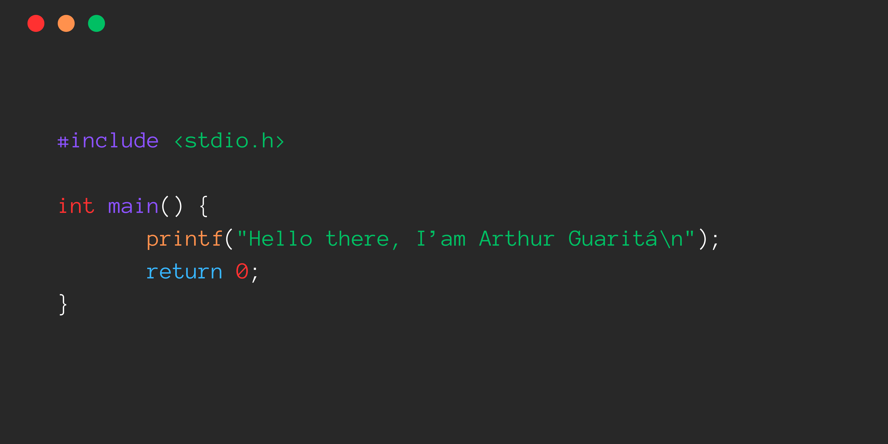

  

## Sobre mim

💻 Atualmente estou cursando Ciência da computação

📚 Estou aprendendo um pouco mais sobre estrutura de dados e C#

💬 Me pergunte sobre desenvolvimento web, matemática, banco de dados ou qualquer problema relacionado a lógica! 

📞 Contato: arthurguaritabrasil07@gmail.com

✨ Curiosidade: gosto de resolver problemas matemáticos e cuidar das minhas plantações no tempo livre

## Minhas habilidades

### Linguagens de programação

### Banco de dados

### Ferramentas e tecnologias

### Frameworks e bibliotecas

### Soft Skills

- Desenvolvimento Ágil
- Comunicação
- Resolução de problemas

## Estatísticas GitHub

